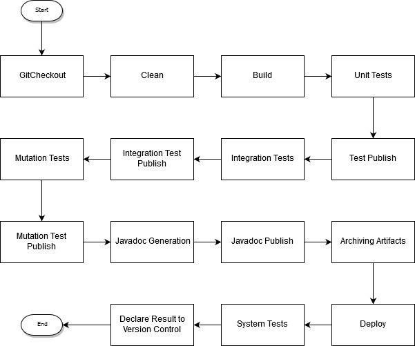

# Component 3 Analysis - Jenkinsfile Sequential Build

**Objective:** Configure a Jenkins Pipeline using a Jenkinsfile, performing a sequential build.

## Sequential Sketch

## Stages

All stages are executed sequentially by the order they are written, unless specified otherwise.

1. ### GitCheckout

Checks out all files from the git repository, **can't do anything else before** completing this stage since **everything is in the repository**.

2. ### Clean

This stage only cleans tests and reports output in order to **avoid errors** further down the road.

3. ### Build

Builds all the code at once, so no need to compile anything else from this point forward. (Also generates the war file)

4. ### Unit Tests

Runs all the Unit tests available

5. ### Integration Tests

Runs all the Integration tests available

6. ### Mutation Tests

Runs all the Mutation tests available

7. ### Javadoc Generation

Generates Javadoc Files

8. ### Archiving Artifacts

Archieves war file previously generated

9. ### Javadoc Publish

Publish Javadoc files previously generated

10. ### Test Publish

Publish Unit tests previously generated

11. ### Integration Test Publish

Publish Integration tests previously generated

12. ### Mutation Test Publish

Publish Mutation tests previously generated

13. ### Deploy

Deploys the application to a TomCat Server.
This **should not be done** before passing all the tests.

14. ### System Tests

In this case is just a simple smoke test to check if the application was indeed deployed.
Can only be done **after** deploy.

15. ### Declare Result to Version Control

Using Bitbucket plugin, it warns the build status (failure/success).
This **must** run as a **post** action since it has to run **always** even when the build fails so that the tag can be added to the repository.