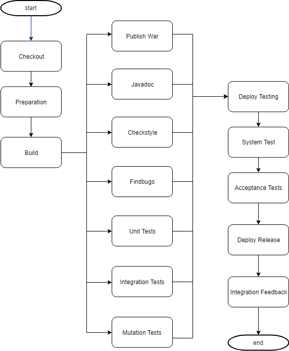

CMS - College Management System
===============================

Neste documento é apresentado todo o processo realizado para o projeto final de **Organização e Desenvolvimento de Software**.

## Branching Strategy

### Gitflow

Durante o decorrer deste projeto foi utilizado o gitflow com recurso à ferramenta **SourceTree** que tornou todo o processo muito mais fácil, sendo apenas necessário clicar num botão para iniciar uma *feature*, *bug fix* ou *release*.
Apesar da equipa envolvida neste projeto ser bastante pequena e o scope deste projeto ser relativamente simples optamos usar o gitflow completo pela facilidade de utilização graças às ferramentas disponiblizadas.

## 2.1 Base Pipeline and Persistence

### Pipeline Design

No Jenkins foi criado um job MultiBranch Pipeline capaz executar o pipeline para os diversos branches do projeto, de modo a permitir **Continuous Integration**.

Passando a explicar as stages do Pipeline de uma maneira muito breve:

1. **Checkout**: obter a última versão dispnível do conteúdo do repositório.

1. **Preparação**: Limpar os relatórios de builds anteriores e terminar quaisquer containers que vão ser utilizados que, possam estar a correr de builds anteriores ou testes.

1. **Build**: Build do projeto inteiro.

1. **Paralelo**: Várias tarefas de *archiving* e documentação, juntamente com análise da qualidade de código.

1. **Preparação para testes**: Arrancar os containers que são necessários para executar os testes.

1. **Testes**: Os testes unitários, de integração e de mutação são todos executados em paralelo.

1. **Deploy para testes**: arranca os containers necessários para os smoke tests e testes de aceitação.

1. **System Test**: smoke test para testar se o sistema está a correr.

1. **Testes de aceitação**: teste que requere uma intervenção manual de um utilizador e uma verificação do software por parte deste.

Á medida que desenvolvemos o pipeline,  não deixamos de notar a elevada complexidade de acções e regras efectuadas num só unico Jenkinsfile. Desde build, a cleanups, a testes, a deployments, a archivements... 

Apesar de ainda utilizarmos o padrão de utilizar um unico multibranch pipeline job com um unico Jenkinsfile, não deixamos de ponderar em talvez dividir a lógica de Deployment para outro job e consecutivamente outro Jenkinsfile proprio em que será utilizado como base o .war file criado no job anterior, arquivado anteriormente num repositorio proprio para artifacts (como artifactory (pago) e/ou Nexus repository OSS (free)). Isto simplificava a leitura e a manutenção de um DevOps responsável pelo sistema de continuous development.

### Diagrama de entidades

Na base de dados é possivel verificar as entidades **Class** e **Students**, com as repetivas ligações representadas na figura seguinte:

Foram também considerados:

* o limite máximo de alunos por turma
* um aluno só pode pretencer a uma turma.

## 2.2 Documentation and Containerisation

### Contentorização de software

Para colocar o nosso software em containers, utilizamos a ferramenta **Docker** que aliado a ficheiros de configuração **DockerFile** criam uma **Docker Image** que vai ser executada num **container**.

O nosso programa está dividido em duas partes. O CMS software que será executado num container com base image de Tomcat 8 (apesar da equipa ponderar utilizar a imagem Java 8 inicialmente). Como o .war file não executa adequadamente utilizando Java, decidiu-se então, utilizar Tomcat. Experimentou-se a base image Tomcat 8 Alpine (muito menos tamanho) que se adequa muito a esta situação onde só um container usa essa base image, no entanto, no final, ficou estabelecido usar a base image normal e completa pela estabilidade. A base de dados H2, foi executada num container separado utilizando uma base image disponivel na **Docker Hub**.

Como ficheiro de 'regras' utilizamos **docker-compose** que indica a ordem e dependências entre containers, entre outras configurações incluindo a **docker-network**, uma rede isolada que permite a comunicação entre containers. Essa comunicação utiliza o nome do serviço como url facilitando o processo.

### Gerar PDF a partir do ficheiro `report.md`

Para gerar o PDF a partir do ficheiro `report.md` após uma breve pesquisa foi encontrado um *plugin* para o gradle, **Markdown-to-PDF**, que satisfaz os requisitos para este projeto, transformando ficheiros *.md* em PDF, pelo que optamos pela utilização do mesmo. 

Para utilizar este *plugin* foi acrescentado ao `build.gradle`: 

* Um *buidscript* com um repositório de *maven* e dependecias; 
* Acrescentado o *id* do *plugin* e versão; 
* E, por fim, acrescentada a tarefa que permite gerar o PDF. 

No entanto, verificamos que caso o pdf já exista não é atualizado, pelo que foi criada uma *task* adicional para limpar algum ficheiro PDF que já exista no diretório antes da criação do PDF.
Esta task foi adicionada às dependências da *task* principal para garantir que é sempre executada antes de criar o PDF.

### Gerar o *ZIP* para submissão no Moodle

Uma vez que o Jenkins tem acesso a todos os artefactos produzidos durante a build e que existe um *plugin*, **Pipeline Utility Steps**, que inclui a funcionalidade de zip, para gerar o ficheiro ZIP de submissão no Moodle, optou-se pela utilização do mesmo.

Foi colocado na **Post Build Action Success** do pipeline uma vez que é suposto ser executado para todas as "*successful builds*".

A **alternativa** a isto seria recorrer a uma *task* no gradle para a criação do zip, mas uma vez que o *plugin* do Jenkins permite arquivar automaticamente o ficheiro criado optou-se por utilizar o *plugin* do Jenkins pela sua simplicidade.

## 2.3 Code Quality and Integration Tests

### Verificação da qualidade do código através de Checkstyle

Para verificação da qualidade de código utilizou-se, como sugerido no enunciado, a ferramenta **Checkstyle**.

Para a utilização da ferramenta foi necessário configurar:

1. Incluir no `build.gradle` o plugin **Checkstyle** e definir quais os ficheiros com as regras de verificação para as *tasks* checkstyleMain e checkstyleTest. Isto foi feito com o intuito de ter regras diferentes para o código de testes, como por exemplo permitir a utilização de packages como o junit;

1. Foram acrescentados os ficheiros de configuração do Checkstyle, respetivamente, `checkstyle.xml` e `checkstyleTest.xml`, com regras distintas como indicado anteriormente;

1. Foi adicionado o plugin **Checkstyle** no Jenkins;

1. Foi adiconada uma *Stage* ao `Jenkinsfile` para a verificação do código recorrendo ao *plugin* referido no ponto anterior.

       Max. avisos unstable: 500
       Max. avisos failure: 300
	   Healthy: 50%
       Unhealthy: 15%

### Verificação da qualidade do código através de FindBugs

Para verificação da qualidade de código utilizou-se, como sugerido no enunciado, a ferramenta **Findbugs**.

Para a utilização da ferramenta foi necessário configurar:

1. Incluir no `build.gradle` o plugin **Findbugs**. Ao contrário do **Checkstyle** neste plugin não foi configurado nenhum ficheiro ;

1. Foi adicionado o plugin **Findbugs** no Jenkins;

1. Foi adiconada uma *Stage* ao `Jenkinsfile` para a verificação do código recorrendo ao *plugin* referido no ponto anterior. Esta stage é executada em paralelo com outras stages de documentação e arquiv

       Max. avisos unstable: 50
       Max. avisos failure: 25
	   Healthy: 50%
       Unhealthy: 15%

### Testes de integração e Cobertura de testes

Tal como no trabalho anterior foram criados testes de Integração para testar as novas funcionalidades.

Foram ajustados os valores mínimos, assim como, o valor máximo da degradação da cobertura de código.

       Cobertura min: 50%
	   Delta máx. de degradação: 15%