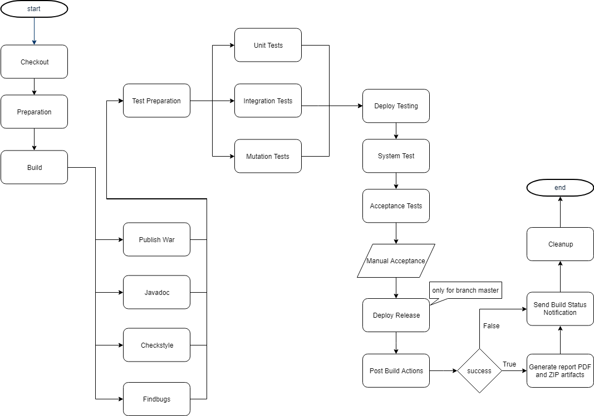

CMS - College Management System
===============================

Neste documento é apresentado todo o processo realizado para o projeto final de **Organização e Desenvolvimento de Software**.

## Branching Strategy

### Gitflow

Durante o decorrer deste projeto foi utilizado o gitflow com recurso à ferramenta **SourceTree** que tornou todo o processo muito mais fácil, sendo apenas necessário clicar num botão para iniciar uma *feature*, *bug fix* ou *release*.
Apesar da equipa envolvida neste projeto ser bastante pequena e o scope deste projeto ser relativamente simples optamos usar o gitflow completo pela facilidade de utilização graças às ferramentas disponiblizadas.

## 2.1 Base Pipeline and Persistence

### Pipeline Design

No Jenkins foi criado um job MultiBranch Pipeline capaz compilar os diversos branches do projeto, de modo a permitir **Continuous Integration**.

### Diagrama de entidades

Na base de dados é possivel verificar as entidades **Class** e **Students**, com as repetivas ligações representadas na figura seguinte:

Foi também considerado o limite de aluno na turma e que um aluno só pode pretencer a uma turma.

## 2.2 Documentation and Containerisation

### Gerar PDF a partir do ficheiro `Readme.md`

Para gerar o PDF a partir do ficheiro `Readme.md` foram encontradas duas formas possíveis de o fazer. 

Na primeira solução encontrada, seria necessário criar um novo projeto, tal como o **CMS**, mas para transformar ficheiros *markdown* em PDF. Esta solução não nos pareceu viável. 

Na segunda solução encontrada, foi verificado que é possível transformar ficheiros markdown em PDF através de *task* no ficheiro `build.gradle`, utilizando o *plugin* **Markdown-to-PDF** baseado em **flexmark**.

Para utilizar este *plugin* foi acrescentado ao ficheiro: 

* Um *buidscript* com um repositório de *maven* e dependecias; 
* Acrescentado o *id* do *plugin* e versão; 
* E, por fim, acrescentada a tarefa que permite gerar o PDF. 

Neste último passo deparamo-nos com um erro em que o tipo associado à tarefa não existia. Para resolver este erro foi necessário verificar o código fonte para perceber que o nome do tipo de tarefa necessitava do prefixo "de.fntsoftware.gradle". 

### Gerar o *ZIP* para submissão no Moodle

Recorreu-se ao plugin do Jenkins **Pipeline Utility Steps**, que inclui a funcionalidade de zip, para gerar o ficheiro ZIP de submissão no Moodle.

Foi colocado na **Post Build Action Success** do pipeline uma vez que é suposto ser executado 

## 2.3 Code Quality and Integration Tests

### Verificação da qualidade do código através de Checkstyle

Para verificação da qualidade de código através do plugin **Checkstyle** no Jenkins foi necessário configurar o projeto **CMS**:

1. Foi acrescentado o ficheiro de configuração do Checkstyle e dos testes , respetivamente, `checkstyle.xml` e `checkstyleTest.xml`, diretamente na pasta **cms**;
2. Acrescentadas as tasks necessárias ao ficheiro `build.gradle`:
	* `checkstyle`
	* `checkstyleMain`
	* `checkstyleTest`

Para verificação da qualidade de código através do *plugin* **Checkstyle** foi necessário instalar o mesmo.

### Verificação da qualidade do código através de FindBugs

### Cobertura de testes

